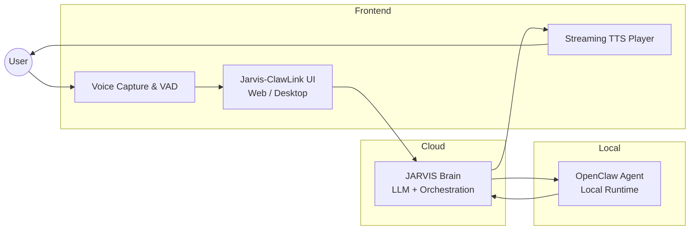

# Jarvis-ClawLink

[English](README.md) | [简体中文](README_zh-CN.md)

A lightweight JARVIS portal that supports one-click installation for quick experience ([Getting Started](#4-getting-started)).

Let anyone quickly experience OpenClaw — real-time voice interaction and full voice control of your local OpenClaw agent.


## 📖 Table of Contents

- [Overview](#1-overview)
- [Features](#2-features)
- [Architecture](#3-architecture)
- [Getting Started](#4-getting-started)
- [Detailed Usage Guide](#5-detailed-usage-guide)
- [Roadmap](#6-roadmap)
- [License](#7-license--许可说明)

---

## 1. Overview

Jarvis-ClawLink is a **voice-first interaction portal** that lets anyone quickly experience OpenClaw:

* 🎤 Talk to your own JARVIS in real time
* 🚀 Support one-click installation, **install and configure OpenClaw locally**
* 🤖 Use voice to **control your local OpenClaw agent** to get real tasks done

**Core Philosophy**: Make it easy for non-technical users to have a personal AI assistant powered by OpenClaw with voice control.

---

## 2. Features

### 🎯 Core Features

* **Real-time Voice Interaction**
  - Streaming voice input/output with low latency and natural rhythm
  - Supports VAD (Voice Activity Detection) for automatic speech recognition
  - Intelligent interruption and recovery mechanisms

* **Automatic OpenClaw Installation**
  - System guides you through the installation process
  - Automatically detects environment dependencies and prompts for installation
  - One-click configuration, no manual operation required

* **Full Voice Control of Local Agent**
  - Trigger local automation scripts, tool calls, and OpenClaw capabilities through voice
  - Supports multi-step execution of complex tasks
  - Real-time feedback on task execution status

* **Unified Interaction Portal**
  - Frontend UI, JARVIS brain, and local OpenClaw Agent integrated in one entry point

* **Beginner-friendly**
  - No need to remember commands or write code—just speak naturally
  - Intelligent intent understanding with natural language interaction
  - Friendly error messages and guidance

---

## 3. Architecture



### Architecture Description

* **Frontend Layer**
  - Handles voice capture, interface display, and streaming playback
  - Processes user interactions and state management
  - Supports desktop applications

* **JARVIS Brain (Cloud/Local)**
  - Responsible for intent understanding, dialogue management, and task planning
  - LLM inference and decision-making
  - Task orchestration and scheduling

* **OpenClaw Agent (Local Execution Layer)**
  - Actually "executes" operations on your local device
  - Calls system APIs and tools
  - Executes automation tasks

---

## 4. Getting Started

### 4.1 Notes

* Our compiled application can automatically guide you through installation of the above environments, or you can install them via command line
* We provide default model configurations for free use. If you want to replace the model, you can modify the model configuration via `openclaw onboard`

### 4.2 Download Pre-built Application

You can directly download the compiled application here. Users can install and complete automated configuration directly, making it convenient for non-technical users.

**Download Link:**  
https://pan.baidu.com/s/1MmTIq3PHgijG0lgXZuRCKQ?pwd=pc33 Password: pc33

* **Mac (Apple Silicon):** JARVIS-1.0.0-arm64.dmg  
* **Mac (Intel):** JARVIS-1.0.0-x64.dmg

After installation, you should see the Jarvis-ClawLink interaction interface in the application and can start voice conversations to control your local OpenClaw.

---

## 5. Detailed Usage Guide

### 5.1 Launch Application and Authorization

#### Launch Application

Double-click the icon to launch JARVIS. On first launch, you need to manually authorize it. The path is:

**macOS Authorization Path:**
```
Settings → Privacy & Security → Scroll to bottom → Security → Click "Open Anyway" for "JARVIS"
```


> 💡 **Tip**: On first launch, the system may prompt for authorization. Please follow the above path to complete authorization to ensure the application runs properly.

#### Enter Application

After entering the application, call mode is enabled by default. You can directly have voice conversations with JARVIS and give commands.

### 5.2 Feature Description

#### 5.2.1 OpenClaw Link Status

**JARVIS-CLAWLINK**

This is a dedicated communication link between Jarvis and OpenClaw, responsible for establishing and maintaining the connection between them. It ensures stable transmission of commands, data, and status information between Jarvis and the tool execution engine.

- **CLAWLINK CONNECTED**: Link successfully established, Jarvis can call OpenClaw capabilities through this link
- **CLAWLINK OFFLINE**: Link not established/disconnected. To reuse local OpenClaw functionality, **you must restart OpenClaw in settings** to reconnect


#### 5.2.2 Local OpenClaw

This is the OpenClaw service running in the local environment, serving as the underlying tool execution engine. It receives task commands from Jarvis, calls various tools (such as code interpreter, search tools, etc.) to handle complex tasks, and returns execution results to Jarvis.

- **Running**: The service is started and available
- **Stop OpenClaw**: Used to terminate this local service


> 💡 **Tip**: If not in daily use, you can stop the OpenClaw link to save resources, or close it when you don't want OpenClaw running.

#### 5.2.3 Function Bar Expand and Collapse

Click the **↑** icon below to expand the application's function bar. Click **↓** to minimize the function bar.


#### 5.2.4 Feature Description

**Text Chat** 📝
- Chat bubble icon for pure text interaction with Jarvis
- Input commands, query information, or have text conversations

**View Logs** 📄
- Document icon for viewing system operation logs, task execution records, or historical interaction records
- Badge shows unread message notifications, convenient for troubleshooting and reviewing operations

**Audio Call** 🎤
- For voice interaction with Jarvis
- Input voice commands through microphone, system responds with voice

**System Settings** ⚙️
- Opens the system settings panel
- Share with Friends directly copies the project GitHub address to share with friends
- Can also perform OpenClaw installation and restart operations


#### 5.2.5 Microphone and Listening Status

**Top Left - Microphone Control Button**

When entering audio call mode, the default **"ACTIVE"** status on the left indicates that the microphone is activated by the system, the audio input device is ready, and Jarvis can start receiving your voice input. Click again to switch to **"MUTED"** status to turn off microphone input.

**Top Right - Voice Listening Status**

- **LISTENING (Voice Listening)**: System is actively listening to voice streams in the environment, collecting audio data in real-time, waiting for your voice commands
- **VOICE CONNECTED (Voice Link Connected)**: Communication link between Jarvis and the underlying voice processing module is successfully established, ensuring voice commands can be stably transmitted and processed


### 5.3 What JARVIS Can Help You Achieve

All scenarios support audio conversation triggers, no complex configuration required, ready to use after installation.

#### 5.3.1 Personal Office Automation

**Email and Document Processing**
- Voice-triggered automation operations to reduce repetitive work
- **Example Command**: "Help me filter today's unread emails from clients, extract key information and generate a summary"

**Schedule and Collaboration Management**
- Integrate with office software to automatically complete schedule arrangements and information synchronization
- **Example Command**: "Help me schedule a requirements review meeting with Xiaoming tomorrow at 2 PM, send a Feishu meeting invitation, and after the meeting, generate meeting minutes and distribute them to attendees"

#### 5.3.2 Life Smart Assistant

**File and Daily Task Management**
- Automate tedious tasks in daily life
- **Example Command**: "Organize my Downloads folder by date and file type, batch rename image files, and automatically backup important documents to the cloud"

**Personalized Life Reminders**
- Tailored to daily needs, providing precise reminders and services
- **Example Command**: "Remind me to take medicine every day at 7 AM, record daily exercise data at 8 PM, and generate a weekly health summary report every Sunday"

#### 5.3.3 Advanced Custom Scenarios

**Custom Workflows**
- Combine multiple operations to automate complex scenarios
- **Example Command**: "When receiving a new customer order project group email, automatically create a project folder locally, assign corresponding responsible person based on recipients, send order confirmation email, update CRM customer status, and generate order invoice"

## 6. Roadmap

### 🚀 Short-term Plans

* [ ] **Video Call Integration**
  - Support real-time video calls with OpenClaw
  - Real-time video stream analysis and processing
  - Task execution based on video content

* [ ] **Enterprise WeChat Mobile Integration**
  - Support mobile Enterprise WeChat audio/video integration with OpenClaw
  - Enterprise WeChat messages automatically forwarded to OpenClaw
  - Mobile voice control of OpenClaw Agent

* [ ] **Multi-process Architecture Optimization**
  - Support multiple sub-process OpenClaw execution
  - Parallel task processing capability
  - Convenient for more task expansion and performance improvement

### 📋 Mid-term Plans

* [ ] **Multi-device Continuous Conversation**
  - Cross-device session synchronization
  - Multi-device collaborative work

* [ ] **Multiple Local Agent Routing**
  - Code Agent (code-related tasks)
  - Doc Agent (document processing tasks)
  - System Agent (system management tasks)
  - Intelligent routing and load balancing

* [ ] **Local Vision Capabilities**
  - Camera input support
  - Image recognition and analysis
  - Screen content understanding

## 7. License / 许可说明

This repository provides binary releases only.

The Jarvis-ClawLink application is currently proprietary software.
The source code is not publicly available at this time.

All rights reserved © 2026 OpenCookAI.

## 🤝 Contributing

Welcome to report issues or make suggestions! Please check [CONTRIBUTING.md](./CONTRIBUTING.md) for contribution guidelines.
---

<p align="center">
  Made with ❤️ by the Jarvis-ClawLink Team
</p>
