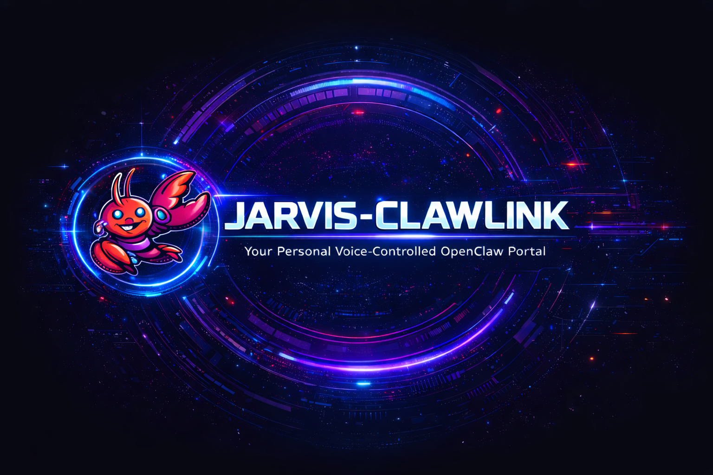
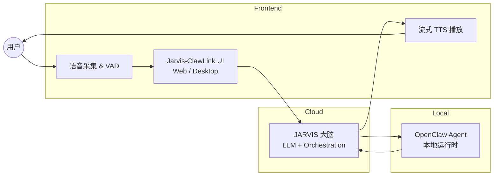
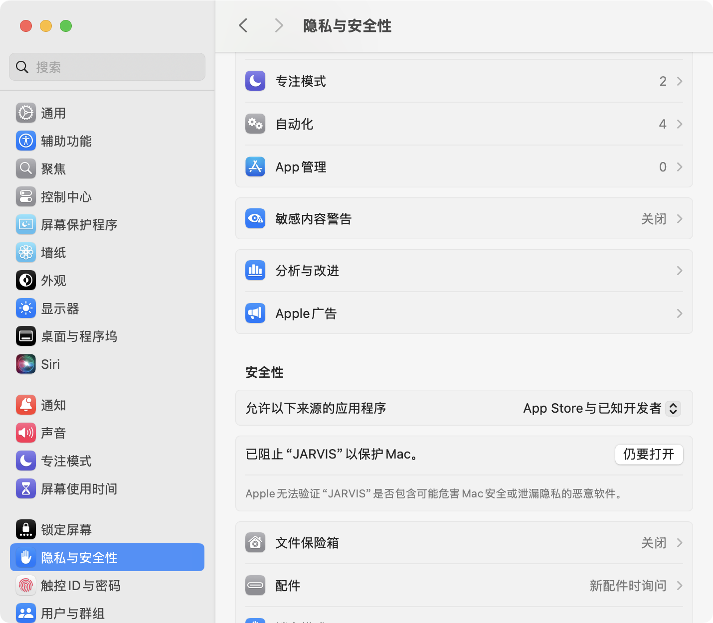
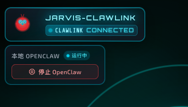
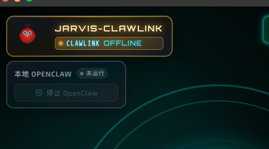
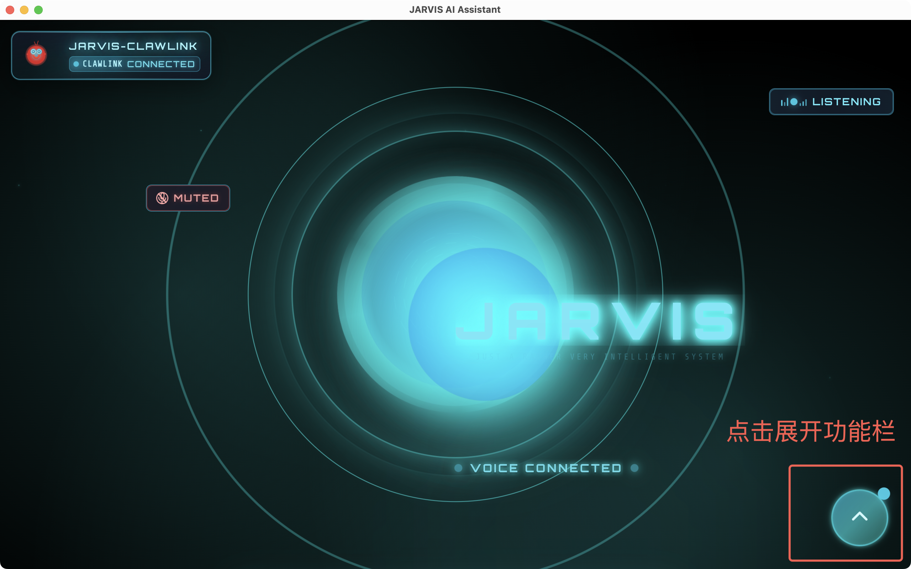
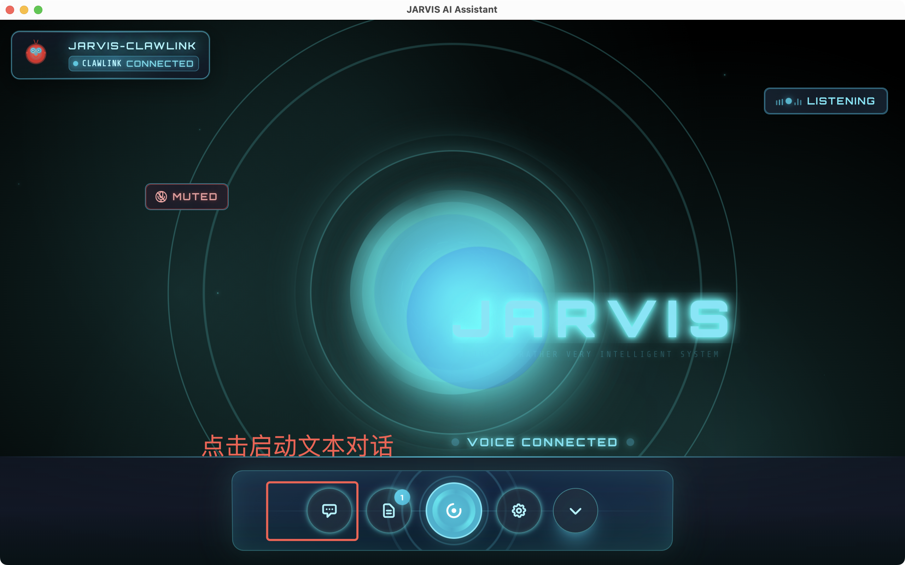
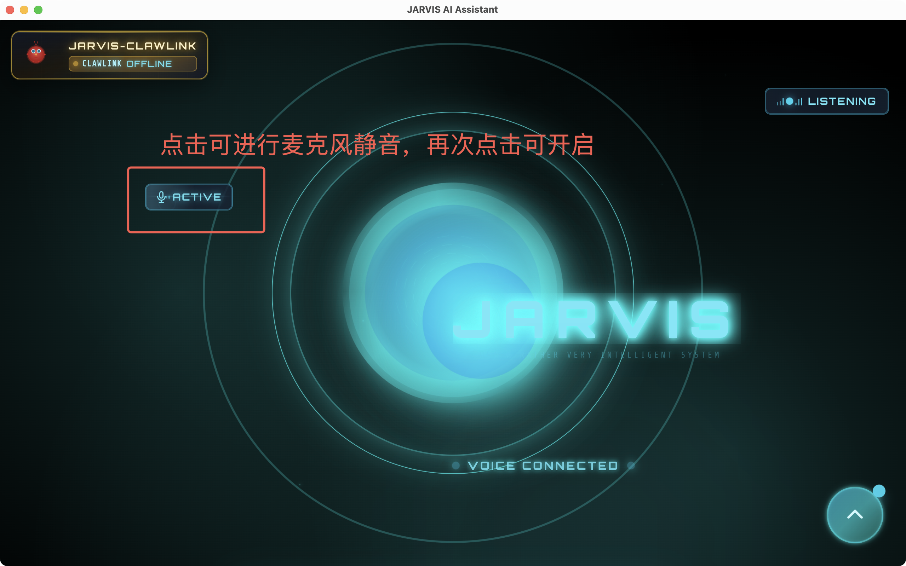

# Jarvis-ClawLink

[English](README.md) | [简体中文](README_zh-CN.md)

一个轻量的 JARVIS 入口，支持用户一键安装快速体验（[快速开始](#4-快速开始)）。

让任何人都能快速体验 OpenClaw：支持实时语音交互，并对本地 OpenClaw Agent 的完整语音控制。




## 📖 目录

- [概述](#1-概述)
- [主要特性](#2-主要特性)
- [架构设计](#3-架构设计)
- [快速开始](#4-快速开始)
- [详细使用指南](#5-详细使用指南)
- [后续规划](#6-后续规划)
- [许可说明](#7-license--许可说明)

---

## 1. 概述

Jarvis-ClawLink 是一个 **以语音为主入口的交互门户**，让用户可以非常轻松地体验 OpenClaw：

* 🎤 像和 JARVIS 一样进行实时语音对话
* 🚀 支持一键安装，**在本地安装并配置 OpenClaw**
* 🤖 用语音直接 **控制本地的 OpenClaw Agent**，完成各种实际任务

**核心理念**：让没有技术背景的小白用户，也能轻松拥有一个由 OpenClaw 驱动、可语音控制的个人 AI 助手。


## 2. 主要特性

### 🎯 核心功能

* **实时语音交互**
  - 流式语音输入输出，延迟低、节奏自然
  - 支持 VAD（语音活动检测），自动识别说话状态
  - 智能打断与恢复机制

* **自动的 OpenClaw 安装**
  - 系统会引导完成安装流程
  - 自动检测环境依赖并提示安装
  - 一键配置，无需手动操作

* **本地 Agent 的全语音控制**
  - 通过语音触发本地自动化脚本、工具调用以及 OpenClaw 能力
  - 支持复杂任务的多步骤执行
  - 实时反馈任务执行状态

* **统一交互入口**
  - 前端 UI、JARVIS 大脑、本地 OpenClaw Agent 在一个入口中打通

* **对小白友好**
  - 不需要记命令、不需要会写代码，说人话就能用
  - 智能意图理解，自然语言交互
  - 友好的错误提示和引导


## 3. 架构设计



### 架构说明

* **Frontend（前端层）**
  - 负责语音采集、界面展示与流式播放
  - 处理用户交互和状态管理
  - 支持桌面应用

* **JARVIS 大脑（云端/本地）**
  - 负责意图理解、对话管理、任务规划
  - LLM 推理和决策
  - 任务编排和调度

* **OpenClaw Agent（本地执行层）**
  - 在本地设备上真正"动手执行"
  - 调用系统 API 和工具
  - 执行自动化任务


## 4. 快速开始

### 4.1 说明

* 我们编译好的应用可以直接引导大家自动安装上述环境，当然大家也可以通过命令执行安装
* 我们默认给大家配置可用的模型，免费方便大家体验。同时如果大家想替换模型，也可以通过 `openclaw onboard` 自行修改模型配置

### 4.2 下载预编译应用

你可以直接在此处下载编译好的应用，用户可以直接进行安装并完成自动化配置，直接使用，方便非技术用户快速上手。

**安装包下载地址：**  
https://pan.baidu.com/s/1MmTIq3PHgijG0lgXZuRCKQ?pwd=pc33 提取码: pc33

* **Mac 电脑 M 芯片下载：** JARVIS-1.0.0-arm64.dmg  
* **Mac 电脑 Intel 芯片下载：** JARVIS-1.0.0-x64.dmg

安装运行，应该可以在程序中看到 Jarvis-ClawLink 的交互入口，并开始语音对话，控制本地的openclaw。


## 5. 详细使用指南

### 5.1 启动应用和授权

#### 启动应用

双击图标启动 JARVIS，第一次启动时，需要手动点击授权，路径为：

**macOS 授权路径：**
```
设置 → 隐私与安全性 → 下滑到底部 → 安全性 → 仍要打开 "JARVIS"
```



> 💡 **提示**：首次启动时，系统可能会提示需要授权。请按照上述路径完成授权，以确保应用正常运行。

#### 进入应用

进入应用后，默认开启通话模式，您可以直接和 JARVIS 语音对话，下达指令。

### 5.2 功能说明

#### 5.2.1 OpenClaw 链接状态说明

**JARVIS-CLAWLINK**

Jarvis 与 OpenClaw 之间的专用通信链路，负责建立并维持两者的连接，保障指令、数据和状态信息在 Jarvis 与工具执行引擎之间稳定传输。

- **CLAWLINK CONNECTED**：链路已成功建立，Jarvis 可正常调用 OpenClaw 能力
- **CLAWLINK OFFLINE**：链路未成功建立/已断开，如要重新使用本地的 OpenClaw 功能，**必须前往设置中重启 OpenClaw**，才能完成重连



#### 5.2.2 本地 OpenClaw

运行在本地环境的 OpenClaw 服务，作为底层工具执行引擎，负责接收 Jarvis 下发的任务指令，调用代码解释器、搜索工具等处理复杂任务，并将执行结果回传给 Jarvis。

- **运行中**：服务已启动且可用
- **停止 OpenClaw**：用于手动终止该本地服务



> 💡 **提示**：日常非使用状态下，可断开与 OpenClaw 的连接，节省系统资源。或者当你希望 OpenClaw 不在运行时，都可以关闭。


#### 5.2.3 功能栏展开与收起

点击下方 **↑** 图标，可展开应用的功能栏。点击 **↓**，可将功能栏最小化。



#### 5.2.4 功能说明

**文本对话** 📝
- 对话气泡图标，用于与 Jarvis 进行纯文本交互
- 输入指令、查询信息或进行文字对话

**查看日志** 📄
- 文档图标，用于查看系统运行日志、任务执行记录或历史交互记录
- 角标为未读消息提示，方便排查问题和回顾操作

**音频通话** 🎤
- 用于与 Jarvis 进行语音交互
- 通过麦克风输入语音指令，系统以语音方式响应

**系统设置** ⚙️
- 用于打开系统设置面板
- Share with Friends 可直接复制项目 GitHub 地址，分享给好友
- 也可以进行 OpenClaw 的安装和重启操作



#### 5.2.5 麦克风和监听状态

**左上角 - 麦克风控制按钮**

当进入音频通话时，默认左侧的 **"ACTIVE"** 状态表示当前麦克风已被系统激活，音频输入设备处于就绪状态，Jarvis 可以开始接收你的语音输入。再次点击可切换为 **"MUTED"** 状态，关闭麦克风输入。

**右上角 - 语音监听状态**

- **LISTENING（语音监听）**：系统正在主动监听环境中的语音流，实时采集音频数据，等待你下达语音指令
- **VOICE CONNECTED（语音链路连接）**：Jarvis 与底层语音处理模块之间的通信链路已成功建立，确保语音指令可以被稳定传输和处理



### 5.3 JARVIS 可以帮助你实现

所有场景均支持音频对话触发，无需复杂配置，装机即可使用。

#### 5.3.1 个人办公自动化

**邮件与文档高效处理**
- 语音触发自动化操作，减少重复工作
- **示例指令**："帮我筛选今日来自客户的未读邮件，提取关键信息并生成摘要"

**日程与协同管理**
- 联动办公软件，自动完成日程安排与信息同步
- **示例指令**："帮我安排明天下午2点与小明的需求评审会，发送飞书会议邀请，会后生成会议纪要并分发至参会人"

#### 5.3.2 生活智能助手

**文件与日常琐事管理**
- 自动化处理生活中的繁琐事务
- **示例指令**："按日期和文件类型整理我的下载文件夹，批量重命名图片文件，将重要文档自动备份到云端"

**个性化生活提醒**
- 贴合日常需求，提供精准提醒与服务
- **示例指令**："每天早上7点提醒我服药，晚上8点记录当日运动数据，每周日生成本周健康汇总报告"

#### 5.3.3 进阶定制场景

**自定义工作流**
- 组合多步操作，实现复杂场景自动化
- **示例指令**："当收到新的客户订单项目组邮件时，自动在本地创建项目文件夹，根据收件人分配对应负责人，发送订单确认邮件，并更新 CRM 客户状态，生成订单发票"

## 6. 后续规划

### 🚀 近期规划

* [ ] **视频通话集成**
  - 支持视频与 OpenClaw 实时通话
  - 视频流实时分析和处理
  - 基于视频内容的任务执行

* [ ] **企业微信移动端集成**
  - 支持移动端企业微信的音视频与 OpenClaw 打通
  - 企业微信消息自动转发到 OpenClaw
  - 移动端语音控制 OpenClaw Agent

* [ ] **多进程架构优化**
  - 支持多个子进程的 OpenClaw 执行
  - 任务并行处理能力
  - 方便更多的任务扩展和性能提升

### 📋 中期规划

* [ ] **多设备连续对话**
  - 跨设备会话同步
  - 多设备协同工作

* [ ] **多本地 Agent 路由**
  - Code Agent（代码相关任务）
  - Doc Agent（文档处理任务）
  - System Agent（系统管理任务）
  - 智能路由和负载均衡

* [ ] **本地视觉能力**
  - 摄像头输入支持
  - 图像识别和分析
  - 屏幕内容理解


## 7. 许可说明

本仓库仅用于发布二进制安装包（DMG）。
Jarvis-ClawLink 应用程序目前为专有软件，
源代码暂未对外公开。

版权所有 © 2026 OpenCookAI


## 🤝 贡献

欢迎报告问题或提出建议！请查看 [CONTRIBUTING.md](./CONTRIBUTING.md) 了解贡献指南。

## 📞 联系我们

* **GitHub Issues**：[提交问题](https://github.com/OpenCookAI/Jarvis-ClawLink/issues)


---

<p align="center">
  Made with ❤️ by the Jarvis-ClawLink Team
</p>
